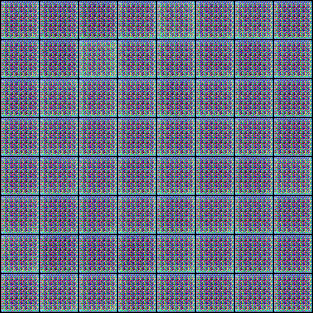
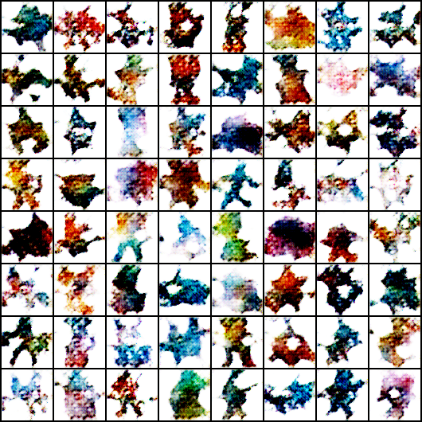
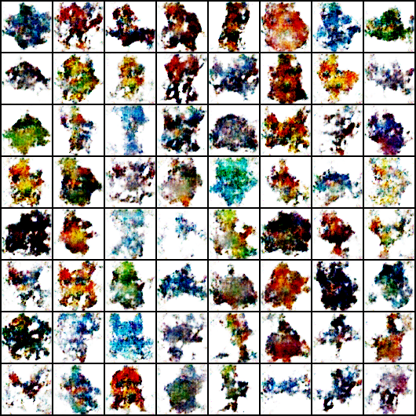
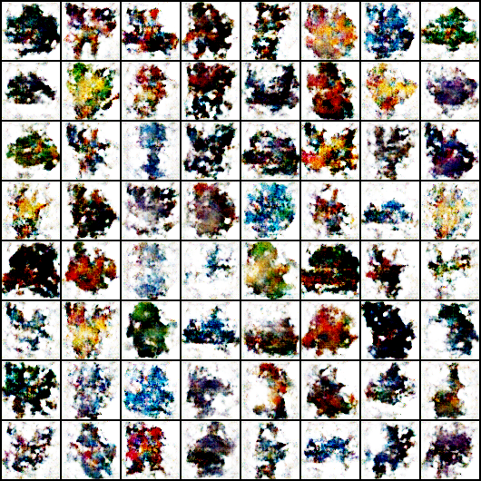
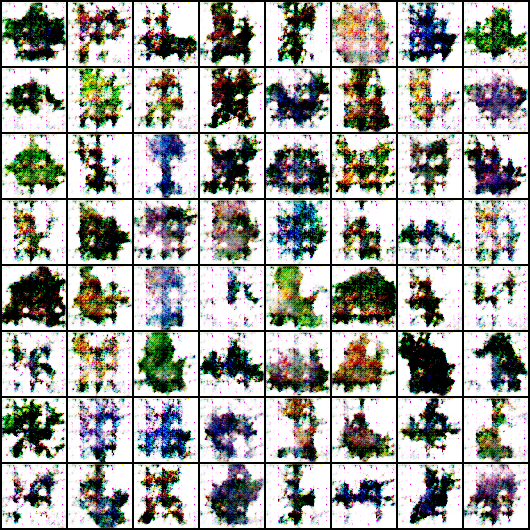

# Automated-Pokemon-Generation-Using-GAN

Using GAN Networks (generative adversial networks) I created a model to automate the process of creating new pokemon designs. In GAN networks there are 2 models. A Generator model that is responisble for creating a fake data, and a discriminator model that is used to distinguish between fake and real data. In GAN these two models are put aganist in adversrial process.

At the start of training the discrimintor model is trained using real data to be able to distingush between real and fake data. For my process I have trained the model using 700+ Pokemon designs of exisitng pokemon.

_Figure 1: At Epoch 1 the output of the generator model._

In the beginning the generator will create images that are nearly random and have no resemblance to the desired output.

_Figure 2: At Epoch 100_

After training for a while the randomness begins to take shape.

_Figure 3: At Epoch 300_

_Figure 4: At Epoch 380_

During the end of the training the images start to look some what similar to pokemon designs. This means that the model works and we are able to get generate fake data.

However during this project I also ran into **model collapse**, when I tried to train the model for more than 400+ epochs.

**Model Collapse:** Its when the generator starts to produce a vert limited variety of outputs, despite the amount of unique data given. It can happen for many reasons, however in my case it happened because the model was trained for a long period of time.

_Figure 5: At Epoch 400_

The model started to lose the details again, if trained for longer it starts to look like Figure 1 all over again.
